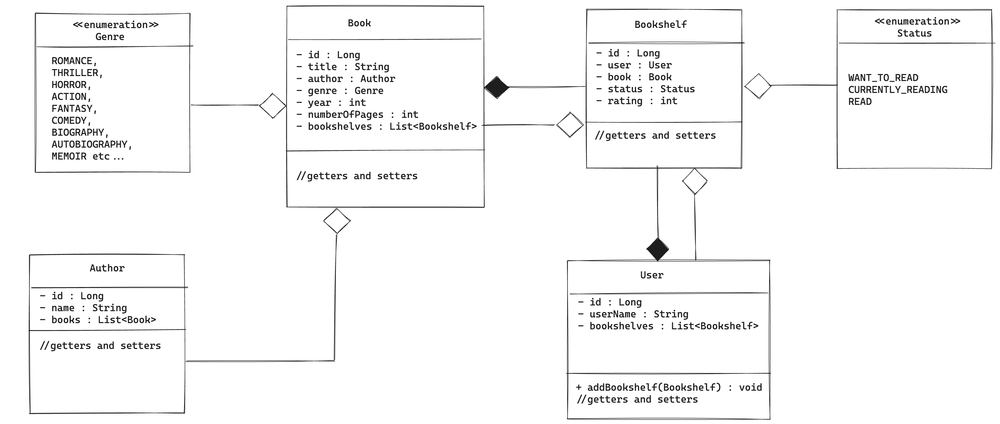
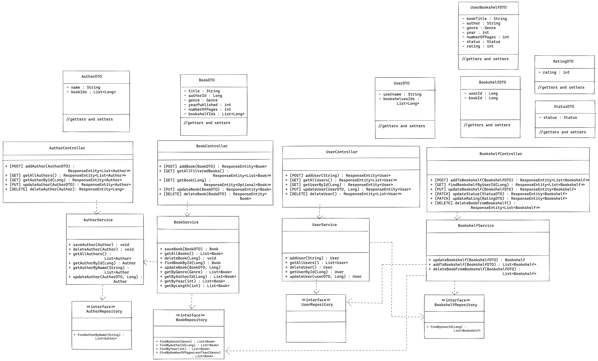
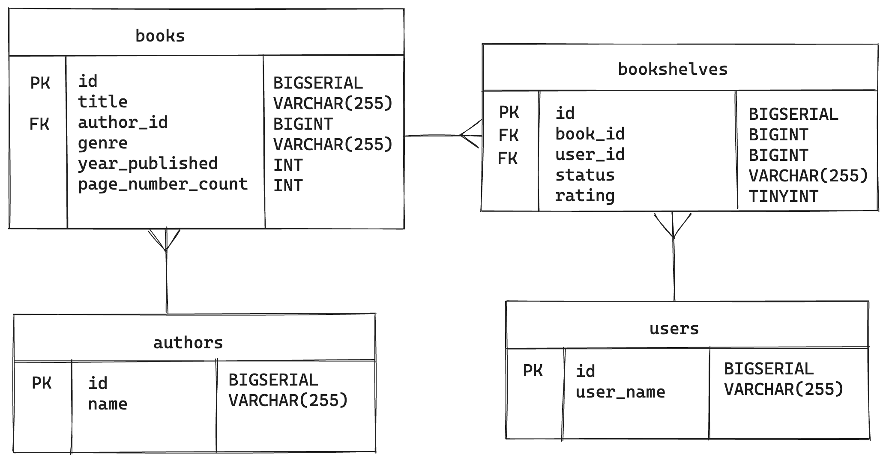

# Better Reads - Backend Restful API

## **_Collaborators_**

- Georgia Crawford-Dellar (GitHub: [GeorgiaCD](https://github.com/GeorgiaCD))
- Francesca (GitHub: [Francescam31](Link))
- Kevin Chan (GitHub: [Kibiko](https://github.com/Kibiko))
- Rohaib Ahmed (GitHub: [rohaib1]((https://github.com/rohaib1)))

## TABLE OF CONTENTS

> 1. Description
> 2. Timestamps 
> 3. Model Descriptions
> 4. Class Diagram
> 5. Entity Relationship Diagram
> 6. How to use the API 
> 7. Limitations
> 8. Tech Stack and dependencies 

## 1. Description

This project is an online bookshelf where users can keep a track of their books they have on the bookshelf. The bookshelf represents the relationship between the user and a book on their list. This is our to-do list.

Each book contains information about that book such as the author, title, genre, year it was released and number of pages and the bookshelf item has status and rating. The status has 3 options, "Want to read", "Currently Reading" and "Read". The user also has the option to rate the book out of 10.

The program can add new books and then assign the book to a user. This new book will now be added to the users bookshelf which acts like a collection of books.

The user also has the ability to filter their bookshelf by the following options: genre, author id, year, length and status.

MVP:
- Add an book to the users bookshelf (List<books_users>)
- Display all books from library
- Display all books in the bookshelf
- Update a book status on your bookshelf
- Delete an item from bookshelf
- Filter items on your bookshelf by properties
You can see a visual representaion of how it all comes together through the UML, ERD and a description of the classes.

### 2. Timestamps 

Thursday 10th August
- Discussed initial ideas, agreed on a bookshelf To-Do list.
- Planned and created ERD.

Friday 11th August
- Determined what would be included in our MVP and what could be possible extensions.
- Began developing UML.

Monday 14th August
- Completed UML.
- Started writing code.
- Completed writing our model classes for Author, Book, Bookshelf and User.

Tuesday 15th August
- Wrote Controllers and Services
- Created DTOs for Author, Book and User.

Wednesday 16th August
- Merged all branches.
- Tested routes in Postman to determine which classes had full CRUD functionality.

Thursday 17th August
- Implemented a filter for getting Books for different properties (author, genre, year published, limited number of pages).
- Implemented a filter for a User's bookshelf to obtain lists of books with different statuses.
- Implemented a rating function in bookshelf to allow users to submit a rating for a book they are reading.

Friday 18th August
- Developed README file.
- Present work.

### 3. Models

### Author (AuthorDTO)

### Book   (BookDTO)
### User   (UserDTO)
### Bookshelf (BookshelfDTO, UserBookshelfDTO)

A bookshelf object contains a bookId, userId, status and rating. The naming does not imply a List but rather the relation between a user and book in terms of the status and rating given. Bookshelf items can be filtered by userId and the status. The status and rating can be updated through the relative bookshelfId and PATCH routes. The BookshelfDTO is used to add a new Bookshelf to the repository (POST) and the UserBookshelfDTO is used to format the information from a bookshelf object to the front end (GET) for clarity when retrieving a user's bookshelf items.

NOTE: in the API, we use the plural bookshelves when referring to a List of bookshelf items. e.g. when referencing a user's "bookshelf" full of books, we name it bookshelves.

### Status  (StatusDTO)
### Genres
Genres are an enum class. 

### RatingDTO

The rating is a property of the bookshelf item rather than the book as each user can review the book and give their rating for it. There is no rating object, however there is a RatingDTO to pass in a JSON body to update the rating for a specific bookshelf item. 

## 4. Class Diagram

### Models

### Service Layers

## 5. Entity Relationship Diagram

## 6. How to use the API 
#### RESTful route endpoints

|Controller | Mapping |Path | Description | Output | 
|----------|-----------|------|-------------|--------|
|Author |GET |localhost:8080/authors|show all authors |Returns a list of all authors|
|   |GET |localhost:8080/authors/{id}|index show author with id={id}|Returns the author with id={id}|
|   |GET |localhost:8080/authors?name=firstName%20lastName|show author by name|Returns author with name = "firstName lastName"|
|   |POST |localhost:8080/authors|create an author |Taking only a name parameter|
|   |PUT |localhost:8080/authors/{id}|edit author with id={id} |Name can only be edited|
|   |DELETE |localhost:8080/authors/{id}|delete author with id={id}|**|
|Book |GET |localhost:8080/books|show all books||
|   |GET |localhost:8080/books?genre=GENRE|show books with GENRE = GENRE ||
|   |GET |localhost:8080/books?authorId={id}|show books with authorid={id} ||
|   |GET |localhost:8080/books?year=int|show books with year = int ||
|   |GET |localhost:8080/books?numberOfPages=int|show books with numberOfPages< int  |returns list of books with page count less than int|
|   |GET |localhost:8080/books/{id}|show book with id ={id}||
|   |POST |localhost:8080/books|creates a book ||
|   |PUT |localhost:8080/books/{id}|edit book with id={id} ||
|   |DELETE |localhost:8080/books/{id}|Deletes book with Id ={id}|**|
|User |GET |localhost:8080/users|show all users||
|   |GET |localhost:8080/users/{id}|index show user with id={id} ||
|   |POST |localhost:8080/users|creates a user ||
|   |PUT|localhost:8080/users|update a user ||
|   |GET |localhost:8080/users/{id}|Returns user with Id = {id}||
|   |DELETE |localhost:8080/users/{id}|Deletes user with Id = {id}|**|
|Bookshelf |GET |localhost:8080/bookshelf|show all bookshelf items||
|   |GET |localhost:8080/bookshelf?userId={id}|show bookshelfs of user with userId = {id} ||
|   |GET |localhost:8080/bookshelf?userId={id}&status=STATUS|Returns bookshelf items with userId = {id} & STATUS = STATUS||
|   |POST |localhost:8080/bookshelf|creates a bookshelf ||
|   |PUT |localhost:8080/bookshelf/{id}|update a bookshelf with bookshelfId ={id} ||
|   |DELETE |localhost:8080/bookshelf/{id}|Deletes bookshelf with Id = {id}||
|   |PATCH | localhost:8080/bookshelf/{id}/rating| | |

### 7. Limitations
(delete mapping etc)

 ## 8. Tech Stack and dependencies 
 The technologies used for this project are:
- Intellij IDEA, running JDK 17
- Postman
- Spring Boot

DEPENDENCIES

- Spring Boot DevTools DEVELOPER TOOLS
- Spring Web WEB
- Spring Data JPA (SQL)
- PostgreSQL Driver 
